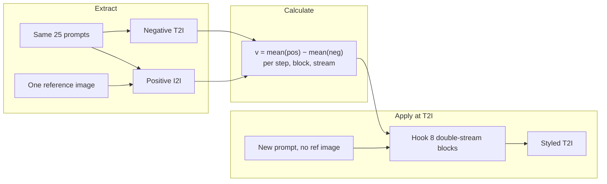



# Klein Reference-Image Style Steering

**Qualitative report** · FLUX.2 Klein 9B · 25 style prompts · three reference images

This note records a first test of **reference-image style steering** on [FLUX.2 Klein 9B](https://huggingface.co/black-forest-labs/FLUX.2-klein-9B). The goal is not yet to beat a strong text-only baseline on a style the model already knows. It is to inject a **new** visual style from a single image, then reuse that signal at text-to-image time.

The grids below are the full 25-prompt comparisons saved in this folder:

| Reference style | Figure |
| --- | --- |
| Picasso | [`picasso_style.png`](picasso_style.png) |
| Luca illustration | [`luca-illustration.png`](luca-illustration.png) |
| Sketch (`strength_img` 6, 7, 12) | [`sketch_style_all.png`](sketch_style_all.png) |

---

## 1. Motivation

The original SHIFT style setup is **text-only**. Positive prompts are of the form `{subject}, {style} style`; negative prompts are the same subjects with no style tag. A mean-difference (or SVM) vector is then applied at inference so that an unstyled prompt is pushed toward the styled distribution.

That construction can only move generations toward styles the backbone already produces when the style is named in text. If the model has never seen the target look — a personal illustration language, an obscure painter, a one-off sketch treatment — the positive class is not a true style class. Steering cannot outperform the model on a concept the model does not already render.

Klein 9B is a unified text-to-image / image-conditioned model. The same prompt can be run **without** an image (T2I) and **with** a shared reference image concatenated into the image token stream (I2I). The positive class is then “this prompt, in the visual context of this picture,” not “this prompt plus a style keyword.” The hope is that Klein’s reference tokens carry palette, texture, and mark-making that text never names, and that those activations can be distilled into a steering intervention for later T2I.

---

## 2. The Klein method

The pipeline is the usual SHIFT three-step loop — extract, calculate, apply — with Klein-specific pairing and token handling. Launchers live under `scripts/`; the experiment root is `experiments/klein_9b/style/<image_stem>/`.

```bash
bash scripts/run_klein_style.sh data/reference_images/<style>.jpg
bash scripts/apply_steering_klein.sh data/reference_images/<style>.jpg
```

### 2.1 Pairing: same prompt, one shared reference

For every line in `prompts_collection/dataset_creation/dataset_prompts_style.txt` (25 short subjects: animals, portraits, landscapes, objects):

| Class | Klein call | What it represents |
| --- | --- | --- |
| **Positive** | `prompt` + one shared `image=` reference | Styled teacher: prompt reimagined under the reference |
| **Negative** | `prompt` only | Unstyled student: ordinary T2I |

The reference is **not** a different prompt and is **not** passed at apply time. One image defines the style for the whole set.

### 2.2 Extract (`src/steering/get_vector_klein.py`)

Hooks the **8 double-stream transformer blocks** of Klein 9B and records residual outputs for the first **4** denoising steps. Each block returns `(txt_hidden, img_hidden)`.

On the positive pass, Klein concatenates generated image tokens and reference image tokens:

```text
img_hidden = [ generated_img_tokens | reference_img_tokens ]
```

Reference tokens are **sliced off before saving**, so positive and negative dumps share token length. Without that cut, a mean-diff vector would not broadcast onto T2I activations.

Dumps are compact prompt-means per `(step, layer, stream)`, plus a token-pooled copy for optional SVM scaling. Streams stored: `img` and `txt`.

### 2.3 Calculate (`scripts/steering_calculate_klein.sh`)

For each timestep t, block ℓ, and stream s (img or txt), the steering vector is the difference of mean activations:

```text
v(t, ℓ, s) = mean(h_pos) − mean(h_neg)
```

That is a **constant offset** in activation space: “what the reference image added, on average, relative to prompt-only T2I.” An optional linear SVM is trained on the same pos/neg pools so apply-time `--use_cls` can scale the offset by how “styled” the current activation looks.

The calculator is the shared SHIFT script `src/steering/calculate_steering_vectors.py` with `--method diff` and `--token_stream both`.

### 2.4 Apply (`src/steering/apply_steering_klein.py`)

Generation is **pure T2I**. No reference image is passed; token lengths must match the sliced extract. Forward hooks on the same 8 blocks add the unit steering vector on the chosen stream(s), then **renormalize** to the original activation norm so magnitude does not explode:

<p align="center"><i>h</i> ← renorm(<i>h</i> + α · <i>v̂</i> · σ)</p>

| Knob | Stream | Role in this test |
| --- | --- | --- |
| `strength` (text-stream α) | text tokens | **0** for all three styles |
| `strength_img` (image-stream α) | image tokens | **0** for Picasso and Luca; **6, 7, 12** for sketch |

The classifier scale σ is 1 unless `--use_cls` is on. Task is `add concept` (add the vector, do not subtract). `--steering_type separate` keeps a per-token vector rather than collapsing to a single mean.

Text-encoder steering (`--steer_txt` / `--strength_txt`) is unused: Klein’s Qwen3 encoder is not hooked.




## 3. Experimental setup

| Item | Value |
| --- | --- |
| Backbone | `black-forest-labs/FLUX.2-klein-9B` |
| Resolution / steps | 1024×1024, 4 steps |
| Prompts | 25 lines in `dataset_prompts_style.txt` |
| Blocks / timesteps hooked | 8 double-stream blocks, 4 steps |
| Vector | mean-diff, dual stream, `--steering_type separate` |
| Text-stream `strength` | **0** |
| Image-stream `strength_img` | **0** (Picasso, Luca); **6, 7, 12** (sketch) |
| Left column in figures | prompt-only / unstyled |
| Right column in figures | styled (reference-conditioned teacher and/or steered T2I) |

Picasso and Luca were run with **both** steering coefficients at zero, so those grids are the **teacher contrast**: what Klein already does when the reference image is present versus prompt-only T2I. Sketch additionally sweeps `strength_img` to see how a constant image-stream offset transfers that look without passing the photo at generate time.

---

## 4. Qualitative results

Across all three styles the same pattern shows up: the method **does pick up the reference palette and a coarse texture**, then tries to **reimagine the prompt inside that look**. Identity of the style (Picasso’s drawing logic, a specific illustrator’s line, true sketch mark-making) is only partly there. The result is a usable starting point, not a finished style transfer.

### 4.1 Picasso



**Palette transfer is the clearest win.** Unstyled T2I stays photographic or generic-digital. The styled column consistently moves toward warmer yellows and oranges, cooler blues and violets, and a flatter, more painterly surface. Landscapes pick up a “golden hour” cast; portraits pick up higher contrast and poster-like backgrounds.

**Style identity is weaker.** The outputs do not reliably become cubist constructions or Picasso-like line. A brown sphere becoming a textured globe, or a yellow square growing illegible script, shows the model grabbing *surface statistics* (color, paper grain, decorative marks) more than the *grammar* of the reference.

**Prompt content mostly survives** (animal, person, object), which is what we want from a steering-style intervention rather than a full image edit.

### 4.2 Luca illustration



The same palette-first behavior, with a different teacher: warmer, parchment-like grounds, grain, and a storybook / vintage-illustration atmosphere. Simple objects (balloon, toy) often gain a textured paper field instead of a clean studio background. Abstract prompts (yellow square, sphere) again over-interpret the reference as texture-plus-lettering rather than a clean fill.

This is encouraging as a **condition** for later learning: positive activations are measurably “in another visual world” than negative ones, even when the world is only approximately the named illustrator.

### 4.3 Sketch — `strength_img` ∈ {6, 7, 12}


Sketch is the only style where the **image-stream coefficient is non-zero**, with text-stream strength still 0. The styled column goes monochrome: deep blues, charcoal, stipple / grain, high-contrast ink. Color subjects (red balloon, yellow field) are overwritten by that palette — again, color and texture more than a clean pencil-sketch construction.

**High `strength_img` is a different failure mode, and a useful one.** As the image-stream offset grows (especially toward 12), generations stop looking like “the prompt, sketched” and start looking like **the reference image with the prompt blended into it**: composition and texture of the photo dominate; the subject is stamped on top. That is consistent with a large additive shift on **image tokens**: the residual is pulled toward the mean of the reference-conditioned pass, which still contains layout and marks of the photo, not only a style direction.

So the sketch sweep shows two regimes:

1. **Moderate image-stream strength** — palette and grain transfer; prompt layout mostly kept.
2. **Large image-stream strength** — conceptual blend of prompt into the reference, closer to image mixing than style steering.

Both are interesting. The second is probably **not** the operating point we want for “new style, same prompt,” but it is evidence that the img-stream vector is a real, high-energy direction — just too entangled with reference content.

---

## 5. What works, what does not

| Observation | Implication |
| --- | --- |
| Color palette and coarse texture transfer on unseen-looking styles | Reference tokens *do* inject a style-like signal that text-only SHIFT cannot invent |
| Brushwork / drawing grammar / illustrator identity are incomplete | Mean-diff is too coarse: one vector averages content, layout, and style |
| Prompt subject usually remains recognizable | Good news for T2I apply without the photo |
| Large `strength_img` blends prompt into the reference | Img-stream *v* is content-contaminated; we need a mapping, not a bigger α |
| Text-stream `strength = 0` in this test | All visible effect is from Klein I2I (teacher) and/or img-stream steering |

The qualitative bar for this round is **not** “beats a style the model already knows.” It is “does the teacher exist, and does a linear offset do anything with it?” The answer is yes, weakly: room for a better extractor of the same pos/neg pair.

---

## 6. Next step: shallow network instead of mean-diff

A single mean-diff vector is prompt-agnostic:

<p align="center"><i>v</i> = <i>h̄</i><sub>pos</sub> − <i>h̄</i><sub>neg</sub></p>

It cannot say “keep this ice bear, only change the marks.” That is likely why large `strength_img` drags in reference layout.

**Proposal.** Train a **shallow network** (linear layer, or a small MLP per block/stream) that maps **negative** activations to **positive** ones:

| | |
| --- | --- |
| Input | negative activations from prompt-only T2I |
| Target | positive activations from the same prompt + reference image |
| Loss | e.g. cosine / MSE on hidden states (optionally per token, with ref tokens still sliced) |
| Inference | run T2I, replace or residual-add the network output at the same hooks, **no reference image** |

That is a **prompt-conditioned** style map: the network can leave content directions alone if they are shared by pos and neg, and only move the residual that the reference actually changed. Residual training is the natural SHIFT-shaped variant:

<p align="center"><i>f</i>(<i>h</i>) ≈ <i>h</i><sub>pos</sub> − <i>h</i><sub>neg</sub>,  <i>h</i><sub>apply</sub> ← <i>h</i> + <i>f</i>(<i>h</i>)</p>

If generations look closer to the teacher (and farther from the high-strength blend), then measure style fidelity.

### 6.1 Metrics after a visual win

Do **not** spend GPU on metrics until the pictures improve. Then:

- **DINOv2 cosine similarity** between each generated image and the **reference style image** (reuse `metrics/dino.py`, but pair against the style photo rather than against unstyled origin). Higher should mean the sample lives closer to the reference’s visual neighborhood.
- Optional controls: DINOv2 vs the **unstyled** origin (content preservation — should stay high) and CLIP text–image on the raw prompt (subject preservation).
- Teacher ceiling: DINOv2(reference, positive I2I images). Apply-time T2I with the mapper should approach that ceiling without needing `image=` at generate time.

---

## 7. Takeaway

Klein reference-image steering is a **teacher–student** construction: I2I with a style photo defines the positive class; T2I is the negative class; apply tries to recover the teacher without the photo.

On Picasso, Luca illustration, and sketch, the teacher already **recolors and retextures** the 25 prompts in the reference’s world, but it is far from a faithful clone of the style. Linear img-stream steering can move T2I in that direction; turning `strength_img` up blends the prompt into the reference instead of isolating style.

The next experiment is to replace the constant mean-diff with a **shallow pos←neg activation mapper**, then — only if that looks better — report DINOv2 similarity to the reference style image.
